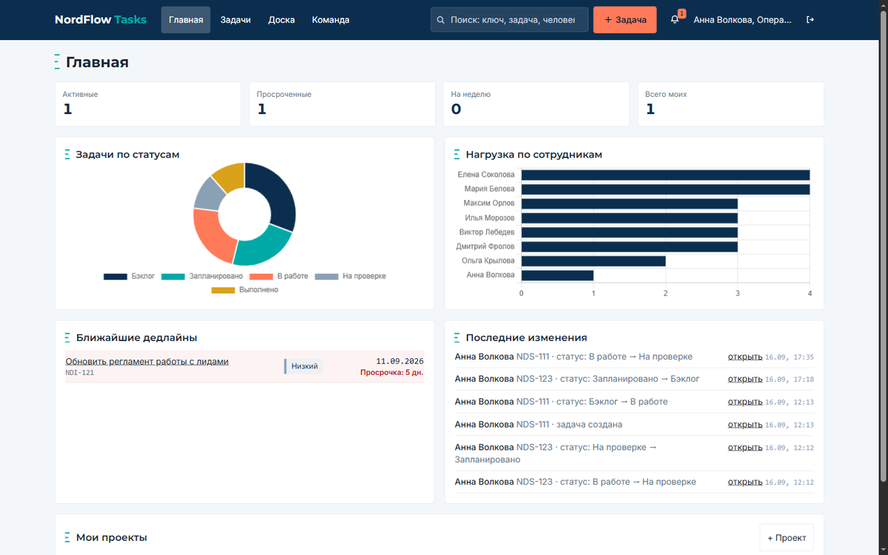
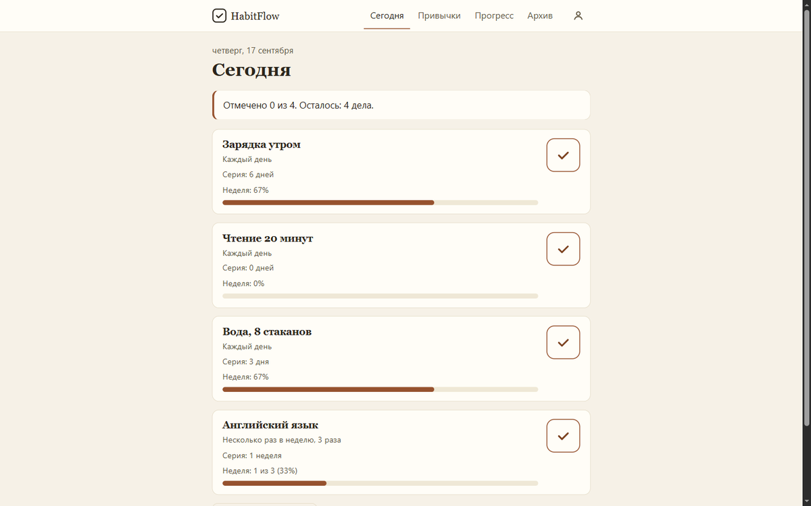
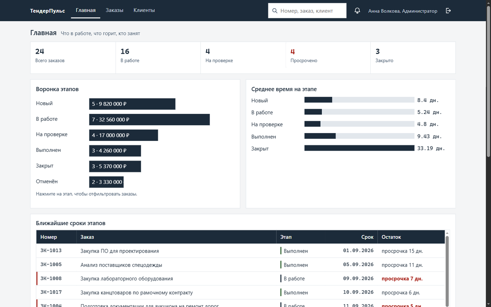
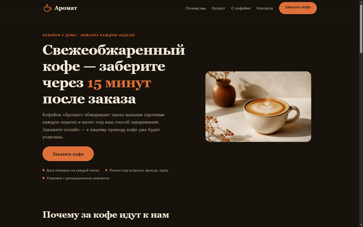
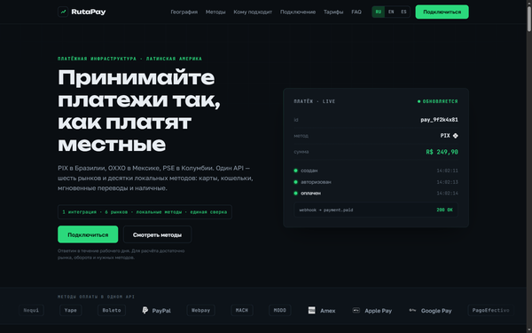

# Bordon — вайб-кодер

Собираю рабочие приложения и автоматизацию под задачу: от разбора требований до задеплоенного результата.
Отдаю не презентацию, а работающую вещь с кодом, инструкцией запуска и честным списком того, что в неё не вошло.

**Связаться: Telegram [@bordon_ai](https://t.me/bordon_ai)**

---

## Что делаю

- **Веб-приложения и трекеры** — роли и права, база, дашборды с графиками, отчёты, канбан, поиск.
- **Лендинги** — страница под услугу или товар: структура, оффер, форма заявки, адаптив.
- **AI-инструменты под задачу** — разбор страниц, генерация контента, скоринг, мультиагентные сценарии.
- **Telegram-боты** — кэш, логирование, воронки анонсов, уведомления.
- **Утилиты и документы** — PDF из CSV и таблиц, конвертеры, CLI.

**Стек:** Python (FastAPI, Flask, aiogram, pandas), JavaScript и TypeScript (Node, React), Convex, PostgreSQL и SQLite, Docker, LLM API (OpenAI, Gemini), Nginx и Traefik.

---

## Кейсы

### Трекеры

Бэкенд с ролями и правами, интерфейс, тесты. Пароль для демо отдаёт `GET /api/demo` — открывайте и заходите.

| | | |
| --- | --- | --- |
|  |  |  |
| [**NordFlow Tasks**](https://nordflow.veynx.xyz/) Задачи и проекты: роли, канбан, история, уведомления | [**HabitFlow**](https://habitflow.veynx.xyz/) Привычки: серии, проценты, тепловая карта, архив | [**ТендерПульс**](https://tenderpulse.veynx.xyz/) Этапы заказов: пайплайн, исполнители, отчёты |

**NordFlow Tasks** — трекер проектов и задач для команды. Три роли с разной видимостью данных, канбан-доска с перетаскиванием карточек, комментарии, история изменений, уведомления по шести поводам, глобальный поиск. 15 тестов, ноль внешних зависимостей.
Исходники: [nordflow-tasks-api](https://github.com/ai4bordon/nordflow-tasks-api)

**HabitFlow** — трекер привычек. Отметка одним нажатием, текущая и лучшая серия, проценты за неделю и за период, тепловая карта по дням, архив с сохранением истории. Серия не рвётся, пока день не закончился, а отмена отметки пересчитывает статистику. 16 тестов.
Исходники: [habitflow-api](https://github.com/ai4bordon/habitflow-api)

**ТендерПульс** — трекер этапов выполнения заказов для агентства. Фиксированный пайплайн с историей переходов, назначение исполнителей, уведомления, отчёты: воронка по этапам, среднее время на этапе, загрузка исполнителей. 18 тестов.
Исходники: [tenderpulse-api](https://github.com/ai4bordon/tenderpulse-api)

### Лендинги — пять ниш.

| | | |
| --- | --- | --- |
|  |  |  |
| [**Психолог и коуч**](https://l1.veynx.xyz/) Личная страница специалиста: с чем приходят, как проходит работа, форма записи | [**Кофейня «Аромат»**](https://l2.veynx.xyz/) Заказ онлайн с обещанием забрать через 15 минут: своя обжарка, помол под способ, меню | [**RutaPay**](https://l3.veynx.xyz/) Приём платежей в LatAm: география, методы оплаты, как идёт платёж, покрытие по странам |
|  |  | |
| [**Northern Monkey**](https://l4.veynx.xyz/) Англоязычный лендинг маркетинговой поддержки под зарубежного заказчика | [**Мотошкола «Трек»**](https://l5.veynx.xyz/) Набор на обучение в Санкт-Петербурге: первый шаг, программа, запись | |

### AI-инструменты

- **[ui-ux-agent-analise](https://github.com/ai4bordon/ui-ux-agent-analise)** — веб-приложение для автоматического UI/UX-анализа лендингов. Мультиагентная система проходит по странице и разбирает юзабилити, структуру, конверсионные места и тексты. Упаковано в Docker — поднимается одной командой.
- **[crewai-advertising-agency](https://github.com/ai4bordon/crewai-advertising-agency)** — прототип рекламного агентства на агентах CrewAI. Команда агентов сама собирает стратегию, тексты и креативы под задачу: показывает, как разложить маркетинговый процесс на роли и передавать работу между ними.
- **[aI_web_analysis](https://github.com/ai4bordon/aI_web_analysis)** — генерация рекламных постов из разбора веб-страницы. Берёт контент сайта, выделяет смысл и предложение, отдаёт готовые тексты через OpenAI API.

### Инструменты и утилиты

- **[hermes-context-optimizer](https://github.com/ai4bordon/hermes-context-optimizer)** — плагин для Hermes Agent: детерминированная оптимизация контекста инструментов, без случайности и магии, результат воспроизводим. Лицензия Apache-2.0, покрыт тестами.
- **[prompt_test](https://github.com/ai4bordon/prompt_test)** — Prompt Test Lab, стенд для прогона и сравнения промптов. Прогон автоматический, ответы сравниваются между версиями, всё крутится в CI на GitHub Actions: сразу видно, не сломала ли правка промпта прежние результаты.
- **[ru2en](https://github.com/ai4bordon/ru2en)** — транскрайбер для тех, кто думает по-русски, а писать нужно по-английски: жмёшь хоткей, говоришь фразу, в поле ввода появляется готовый английский текст. Покрыт тестами.
- **[mortgage-calculator](https://github.com/ai4bordon/mortgage-calculator)** — калькулятор ипотечных платежей: ежемесячный платёж, переплата, сравнение вариантов.

### Участие в опенсорсе

- **[gsd-ui](https://github.com/ai4bordon/gsd-ui)** — форк [`Stolkmeister/gsd-ui`](https://github.com/Stolkmeister/gsd-ui). Автор кода не я: мой вклад — четыре коммита, согласованность роадмапа и требований, маршрутизация фаз и совместимость парсера планирования.

---

## Как я работаю

1. Разбираю задачу и фиксирую критерии приёмки — до кода.
2. Собираю работающий прототип, а не макет.
3. Показываю на живом деплое по ссылке, а не на скриншотах.
4. Отдаю репозиторий, README с запуском одной командой и список того, что осознанно не вошло.

---

## English

**Bordon — vibe-coder.** I build working applications and automation to order: web trackers and dashboards, landing pages, AI tools, Telegram bots, document utilities.

**Stack:** Python (FastAPI, Flask, aiogram, pandas), JavaScript and TypeScript (Node, React), PostgreSQL and SQLite, Docker, LLM APIs (OpenAI, Gemini), Nginx and Traefik.

### Selected work

- **Trackers, full stack with tests and live deployment** — [NordFlow Tasks](https://nordflow.veynx.xyz/), [HabitFlow](https://habitflow.veynx.xyz/), [ТендерПульс](https://tenderpulse.veynx.xyz/)
- **Landing pages, five niches** — [therapist](https://l1.veynx.xyz/), [coffee shop](https://l2.veynx.xyz/), [payments in LatAm](https://l3.veynx.xyz/), [marketing support](https://l4.veynx.xyz/), [motorcycle school](https://l5.veynx.xyz/)
- **AI tools** — [ui-ux-agent-analise](https://github.com/ai4bordon/ui-ux-agent-analise), [crewai-advertising-agency](https://github.com/ai4bordon/crewai-advertising-agency), [aI_web_analysis](https://github.com/ai4bordon/aI_web_analysis)
- **Utilities** — [hermes-context-optimizer](https://github.com/ai4bordon/hermes-context-optimizer), [prompt_test](https://github.com/ai4bordon/prompt_test), [ru2en](https://github.com/ai4bordon/ru2en)
- **Open source** — [gsd-ui](https://github.com/ai4bordon/gsd-ui), a fork of Stolkmeister/gsd-ui with my four commits on roadmap consistency and phase routing

Every project ships with a README, run instructions and tests.

**Contact: Telegram [@bordon_ai](https://t.me/bordon_ai)**
